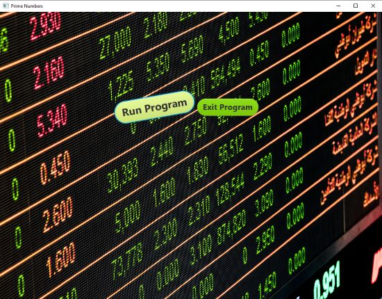
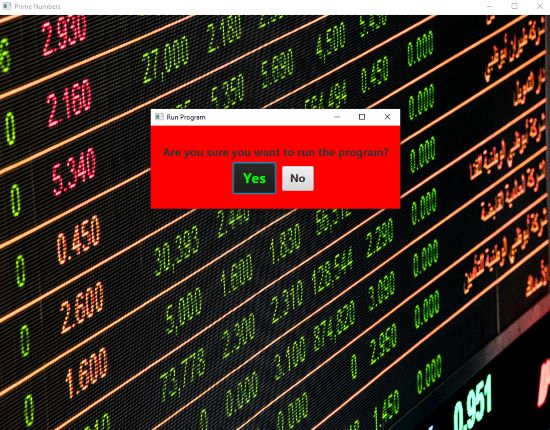
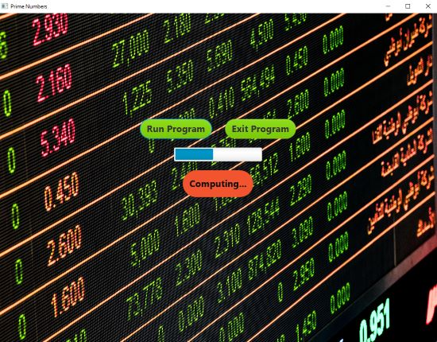
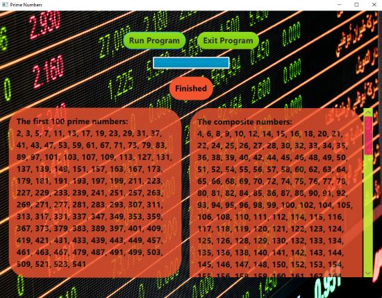
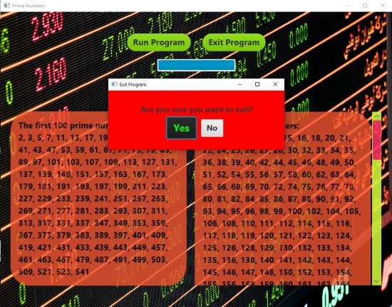

<h1 align="center">Welcome to Prime Numbers</h1>

<!--  -->

<h4 align="center">
  Javafx: clicking on the run button will display a status bar of the program finding the first 100 prime numbers.  Once it is finished, the first 100 numbers are displayed along with the non prime numbers.
</h4>
 

<h2 align="center" style="text-decoration: underline;">Using this GUI is as follows:</h2>

<h4 align="center">
    1. Click on the Run Program button to run the program.

</h4>

<h4 align="center">
    2. Click on the Yes button to confirm you want to run the program.  Click on the No button to return to the main page.

</h4>

<h4 align="center">
    3. Once the Yes button is selected, the program will begin to run.  A computing sound can be heard along with a moving status bar.

</h4>

<h4 align="center">
    4. Once the program is done running, a display of the first 100 prime numbers will be displayed along with all the other numbers that were not prime.

</h4>

<h4 align="center">
    5. Once finished with the program, clicking on the Exit Program button will show a confirmation box.  Clicking on the Yes button will terminate the program and close it.

</h4>
<!-- For more details see [GitHub Flavored Markdown](https://guides.github.com/features/mastering-markdown/). -->
<!-- You can use the [editor on GitHub](https://github.com/zuki07/Prime_numbers/edit/gh-pages/index.md) to maintain and preview the content for your website in Markdown files. -->
